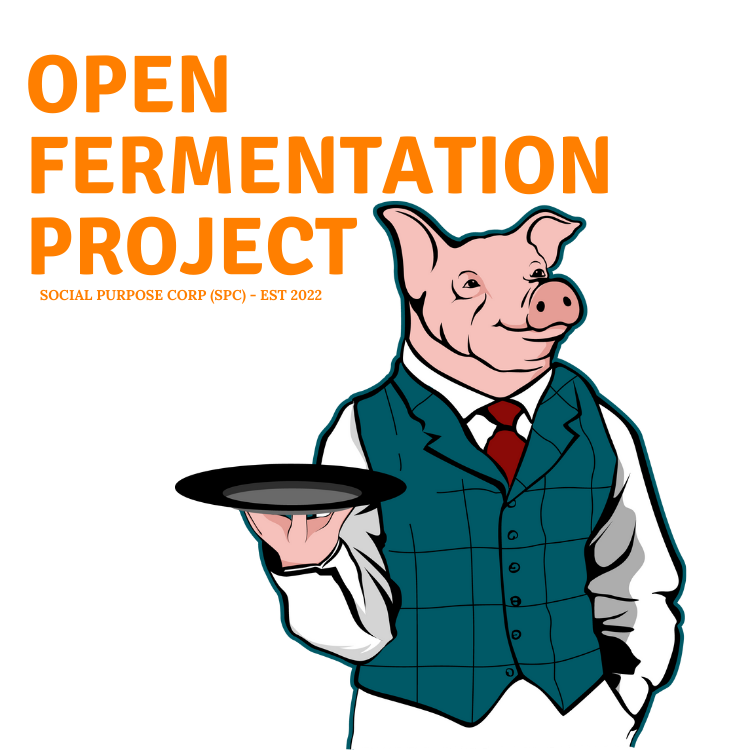
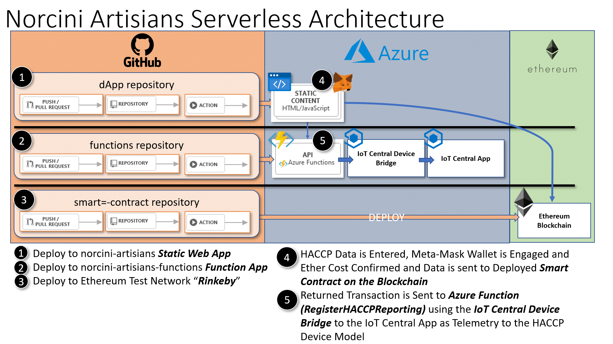
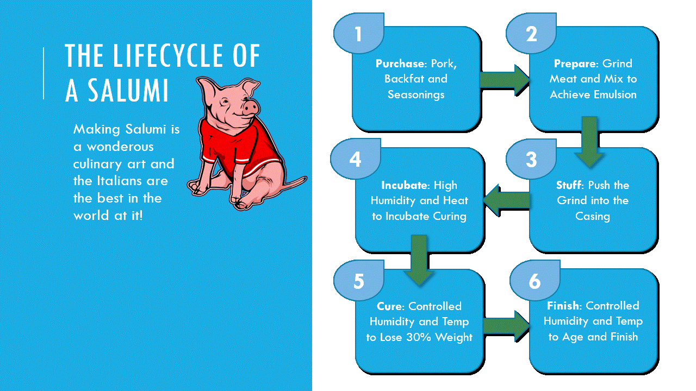
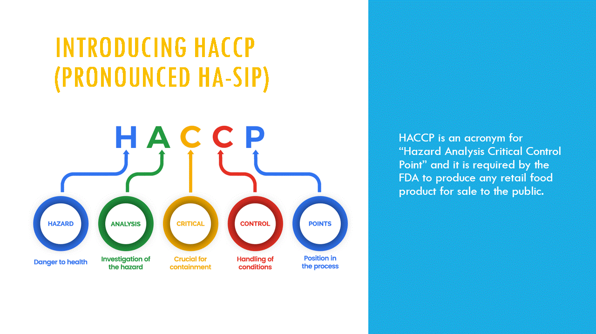
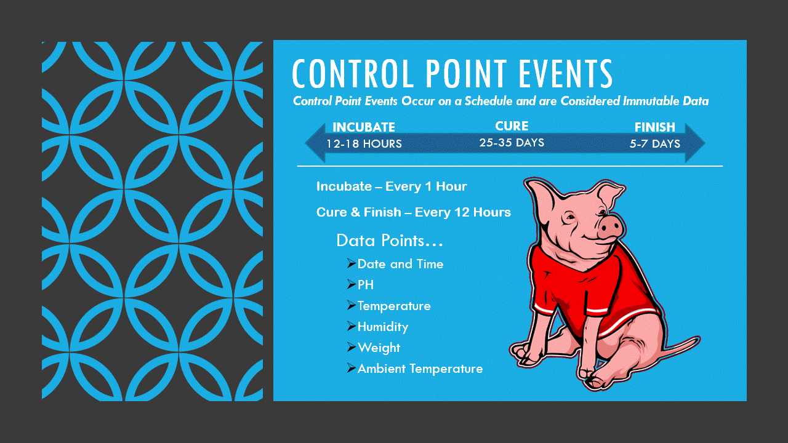
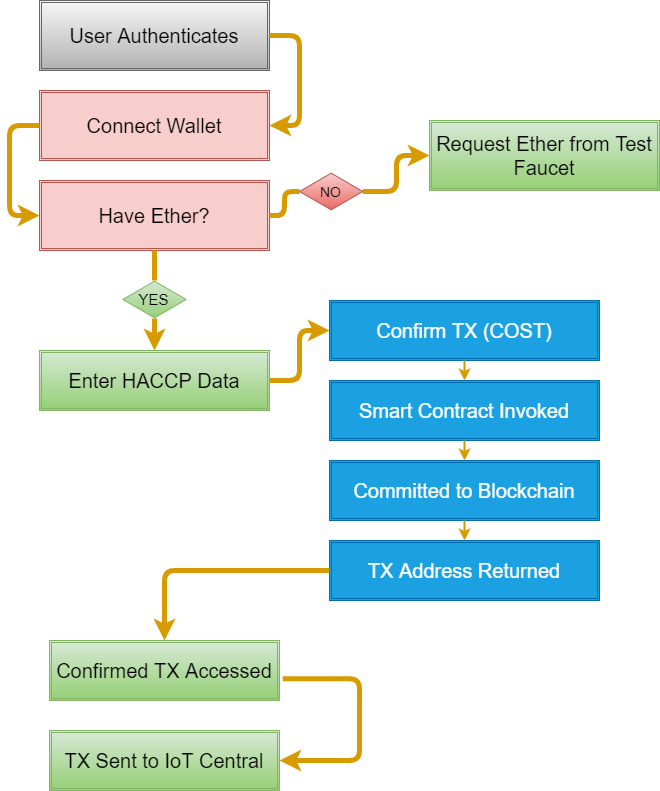

&nbsp;&nbsp;&nbsp;&nbsp;&nbsp;&nbsp;

# SimulATE Spring Sesssion
Speakers: Larry W Jordan Jr & Mark Huang

### Session Code and Artifacts

# Saluminator Blockchain Ethereum dApp Overview

This folder in the repository provides the code we created to simulate a "Supply Chain" and "HACCP Events" Integration with Ethereum Blockchain via Smart Contracts.

## Lifecycle of a Salumi

The concepts we are trying to land with this dApp proposes that if the entire lifecycle of a pig as "Birth to Consumer" could be tracked in an immutable way, we achieve a transparent system that empowers anyone to confirm that the food they are eating is documented.

## HACCP Overview

HACCP is a management system in which food safety is addressed through the analysis and control of biological, chemical, and physical hazards from raw material production, procurement and handling, to manufacturing, distribution and consumption of the finished product.

## HACCP Control Point Events

The Saluminator HACCP Plan Captures Critical Points in the Fermentation Lifecycle.

## dApp Flow

1