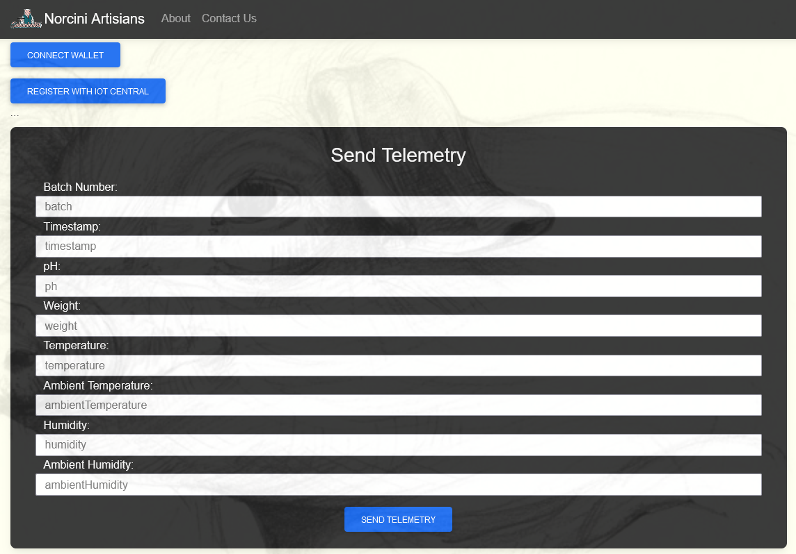
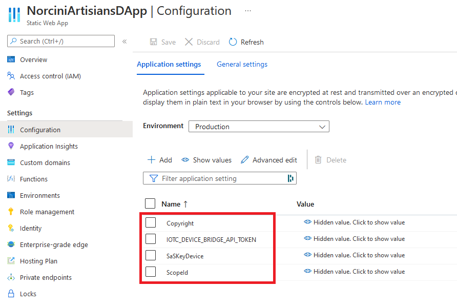

&nbsp;&nbsp;&nbsp;&nbsp;&nbsp;&nbsp;

# SimulATE Spring Sesssion
**Speakers**: Larry W Jordan Jr & Mark Huang

## Ethereum dApp Overview

This folder in the repository provides the code we developed to implement a "Decentralized Application" referred to as a "dApp" for integration scenarios with Ethereum blockchain via  Smart Contracts.

### Deploying the Static Web App
This repository contains the web site that we can deploy to an Azure Static Web App. The first thing is familairze yourself with the Azure capabilities for Azure Static Web Apps's and the link below will provide that overview...

[Static Web Apps](https://azure.microsoft.com/en-us/services/app-service/static/#overview)

The static web app we developed is easy to customize for you to be able to experiment. For completeness we have included files for About, Privacy Policy, etc. Feel free to customize and please remove links to our sites.

All of the HTML is contained in the [index.html](./index.html) and the Script Code [app.js](./js/app.js) with a couple other supporting files you will see linked in the code.

This is the main page...

We host the code and all of the demo end to end, it is located at [Norcini Artisians dApp](https://www.norciniartisians.com) you can try all of the options. You will not be able to sign into the Azure IoT Central application without being added to the application. If you need help with that or want to check it out, contact us.

### Azure Functions
Next, we use Azure Functions to provide dynamic and run-time capabilities to our Static Web App. You maybe used to being able to execute "service-side" code in other web development and hosted environments, but that is not a capability to run code behind approaches in Static Apps. We use Azure Function to accomplish equivilant things.

[Azure Functions](https://azure.microsoft.com/en-us/services/functions/#overview)

We have the following capabilities...

* RegisterHACCPReporting
* Navigation
* Footer

__RegisterHACCPReporting__
This function is the code that provides the "Bridge" between the web app and the API for the Azure IoT Central application. The main code is contained in the *index.js* file and closely follows standard approaches to extending and integrating with Azure Iot Central.

Here are examples references for learning...

* [iotc-nodejs-device-client](https://github.com/lucadruda/iotc-nodejs-device-client)
* [azure-iot-sdk-node](https://github.com/Azure/azure-iot-sdk-node)

The code in this repository builds from these apporaches. The key thing to remember is that there are "secrets" your application has for connecting via an API/Device and we need a way to access those values at runtime and never in our checked-in code :)

When you access your Static Web App in the Azure Portal, there is an option for *Confguration* and the following values are setup for the application to pull those values at run-time and they include...

